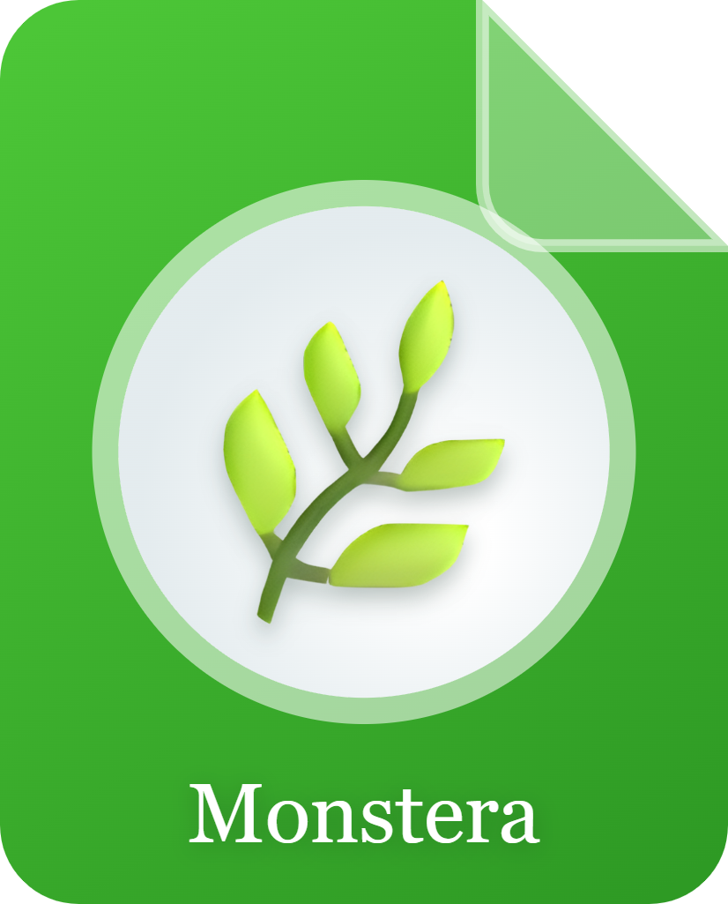

<div align="center">



# Monstera PDF Editor

**Built For The Way You Work**

A free, open-source, professional-grade PDF editor for Windows.

[](https://github.com/tenslorai-tar/monstera/actions/workflows/guards.yml)
[](LICENSE)

</div>

---

## Status: in early development — not yet usable

**There is no release yet.** The project is building its architecture before its
features, deliberately, and that work is public from the first commit.

This section is the honest picture and it is kept current. If you are looking
for a PDF editor to use today, this is not one yet.

| Stage | Scope | State |
|---|---|---|
| 0 | Walking skeleton — the whole architecture, end to end | **in progress** |
| 1 | Viewer core: render, search, tabs, zoom quality | not started |
| 2 | Page management | not started |
| 3 | Annotations and markup | not started |
| 4 | Forms | not started |
| — | **1.0 ships here** | — |
| 5–10 | Text editing, OCR, security and signatures, import/export, AI, ship | not started |

Feature-by-feature status lives in [`docs/FEATURES.md`](docs/FEATURES.md).

## What it is meant to be

A PDF editor that is genuinely professional-grade — the benchmark is PDF-XChange
Editor parity or better — and genuinely free. Viewer, page management,
annotation, forms, in-place text editing, OCR, redaction and digital signatures,
export and conversion, in a dense, calm Windows desktop UI with light, dark and
high-contrast themes.

It will be distributed through the **Microsoft Store** and from
**monsterapdf.com**.

### Things it will not do

- **No telemetry.** None. The only network call the app makes on its own is the
  update check, and the About panel says so.
- **No silent cloud upload.** Document content reaches an AI provider only on an
  explicit user action, and the consent copy names the provider receiving it.
- **No plaintext secret storage.** API keys go to the OS keychain, or the app
  says it cannot store them and refuses. There is no silent fallback.

## Why the codebase looks the way it does

**The codebase is the product as much as the app is.** It is written to be read.

Two documents govern it:

- **[`BUILD-PROMPT.md`](BUILD-PROMPT.md)** — the founding record. Never edited
  after its first commit.
- **[`docs/ARCHITECTURE.md`](docs/ARCHITECTURE.md)** — the living law. Changed
  only through a recorded amendment, with the rejected alternatives written
  down.

The rule underneath both:

> When you hit a problem, do not quickly find a workaround. Investigate the root
> cause and fix it from the root. Your first intuition must not be a workaround;
> it must be investigation.

Every workaround in a public codebase is a permanent, signed statement that
nobody understood the problem. So the standard here is that you can state the
actual mechanism in one sentence before you change a line — and every fix ships
a proof with a control case, meaning the proof fails if the fix is removed.

If that sounds like the kind of codebase you want to work in, see
[`CONTRIBUTING.md`](CONTRIBUTING.md).

## Building from source

Requires Node.js 22.12 or newer and Git.

```bash
git clone https://github.com/tenslorai-tar/monstera.git
cd monstera
npm install
```

`npm install` also enables this repository's git hooks, which scan for secrets
and reject binaries and oversized files before they can enter the permanent
public history. If a commit is rejected because the scanner is not installed,
run `node scripts/provision/gitleaks.mjs` — **do not bypass the hook.**

More build and run instructions land as Stage 0 completes.

## Licence

**[AGPL-3.0-or-later](LICENSE).**

Monstera links MuPDF and ships `mutool`, both AGPL, so the combined work is
AGPL. In plain terms: you may use, study, modify and redistribute this software,
and if you distribute it — or run a modified version as a network service — you
must offer the corresponding source under the same licence.

Third-party notices are generated from the lockfile at package time rather than
hand-maintained, so they cannot drift from what actually ships.

The **brand assets** in [`assets/brand/`](assets/brand/) are owned by Tenslor
Inc. and are not covered by the code licence — a fork must use its own, so users
can tell whose build they are running.

## Security

Please report vulnerabilities privately. See
[`SECURITY.md`](SECURITY.md).

---

<div align="center">
<sub>© 2026 Tenslor Inc.</sub>
</div>
